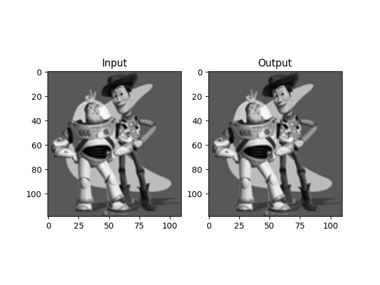
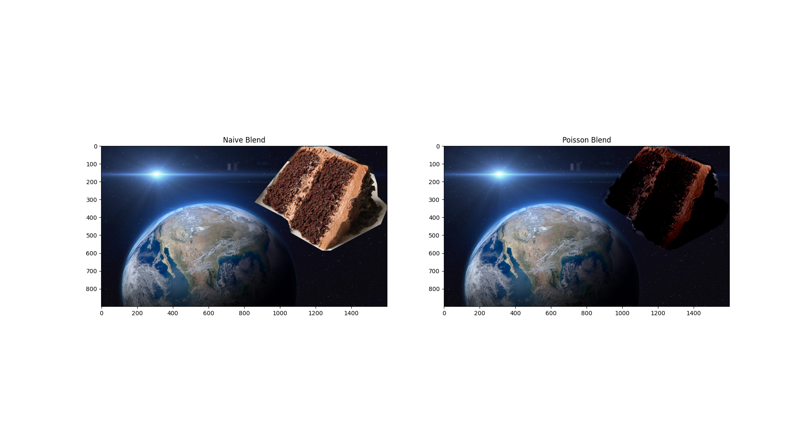
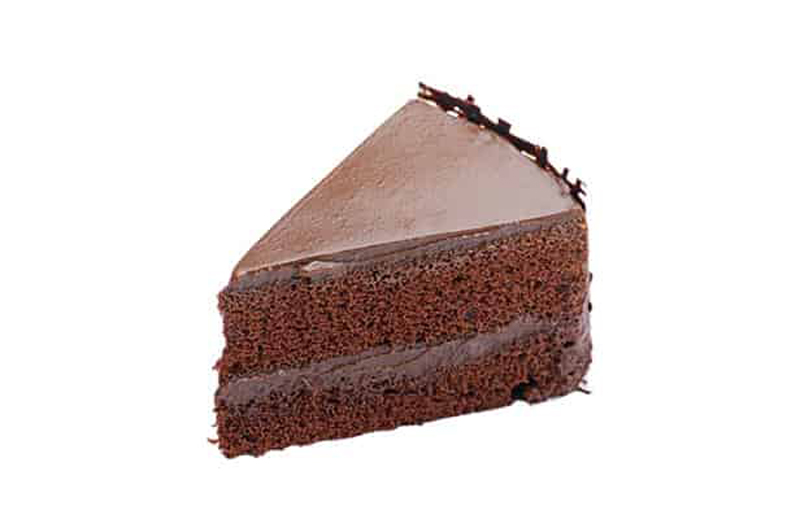
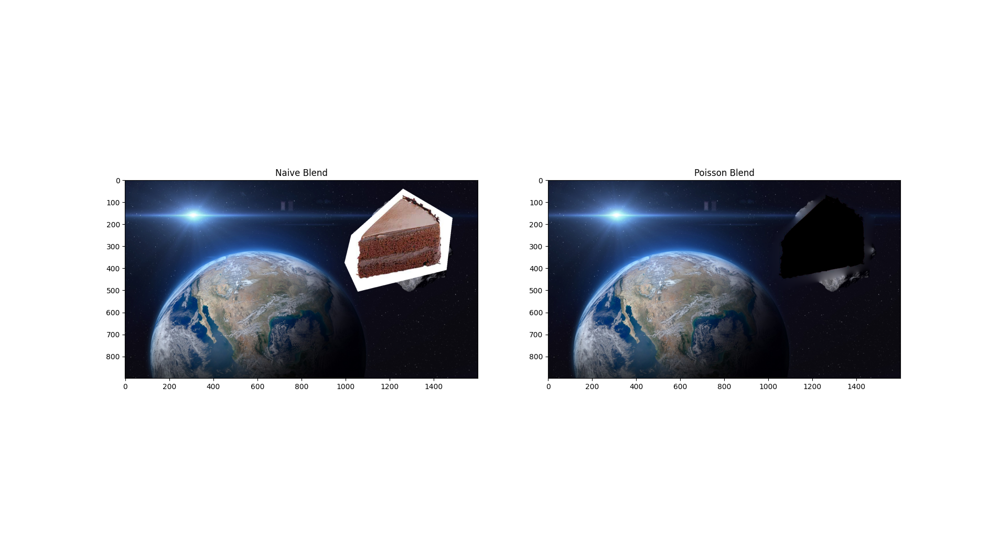
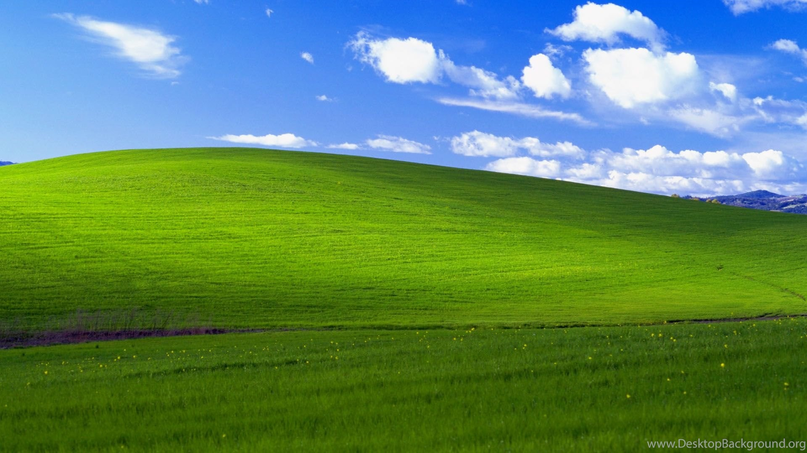
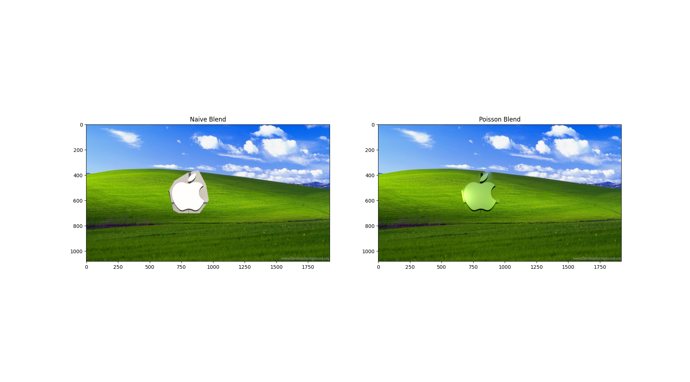
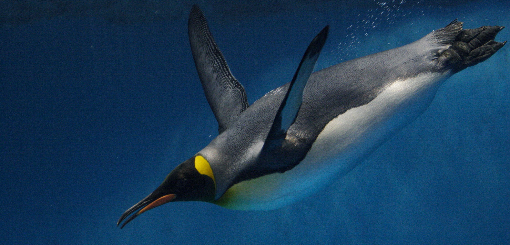
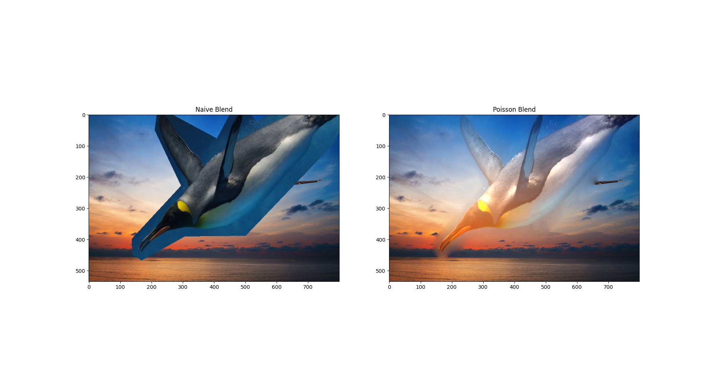
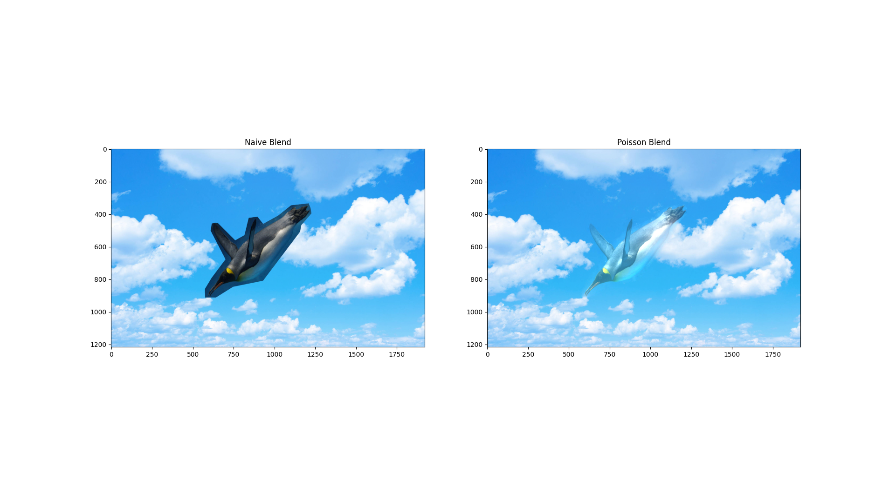

# 16-726 P2: Gradient Domain Fusion

For this project we were asked to build a system that could stitch in a source image to a target domain; much like we might want to stitch a subject into the foreground of another image's background. The main technical requirement was to make this stitch seam perceptually non-obvious, which requires blending of the seam colors.

The approach is to use Poisson blending; this method uses the insight that we mainly desire to stitch in source gradients rather than source pixel intensities themselves per-se; so we optimize for a new version of the source that preserves its gradients, including when the gradient is computed at the seam. This distributes seam discontinuities throughout the source region.

## Results
### Toy problem
First we were asked to implement a basic version of the blending algorithm on a toy problem. Since there are no boundary constraints, the stable solution is presumably to simply reconstruct the input.

### Blending showcase

Cake in space.

Source, Target

Blend:

Because of the darkness of space, the blending is pretty non-obvious. The cake surroundings loses its halo, but the cake itself is still clearly visible. It does sort of give the impression that a cake slice is looming in space. Nothing special was done for this image.

How this works: As mentioned, the paste essentially replicates the perceptual features of the source, but attempts to match the seam's gradient to the source gradient at the seam. In an implementation oversight, I actually clipped one pixel inwards (so source gradients are only accounted for within mask).  Since only source gradients "matter," the cake doesn't show the strip of light running across the asteroid. Different from the toy example, here it is important to account for all directional neighbors (instead of just right and down), else top-left seams will appear. I account for boundary updates simply by updating the least squares objective with the fixed boundary terms.

### Other examples
Most other results don't actually appear as well.

**Cake on white**
For example, with another cake sample, the halo blend occurs, but since LSQ isn't really constrained to behave in image space, the transition from background to cake sends the cake pixels out of bounds (and is clipped to 0). This might be ameliorated with rescale cake pixels specifically, but that wouldn't really address the core issue. Perhaps constrained least squares could help.

New cake source

New blend

**Apple on windows background**
I was curious how a sharp contrast in the subject domain would be maintained in another setting, so I tried pasting the Apple logo into the Windows 07 grassy plains.

Source, Target

Blend

The result seems pretty reasonable. Indeed, color bleeds all over the source. Also, it's not great that unintended edges/gradients -- perceptually not what I'm aiming for -- still show prominently (e.g. the beams at the top and left of the crop). This is however entirely expected from the algorithm.

**Penguin with alpha**
I tried pasting a penguin into two sky scenes, eventually realizing that an alpha channel available in the image source is likely causing the transparency effects in the resulting blend. That is, it seems like the actual intensities of the penguin source are not the same as they appear with alpha; post-blending (and cropping alpha channel), perhaps the blend seems _more_ transparent than the original image. (Actually, logic would suggest that the reverse transparency order should hold since pixels gain full intensity, but I'm fairly positive alpha is the culprit.)

Penguin source, target 1, target 2

Blend 1, blend 2

The results are etheral.
